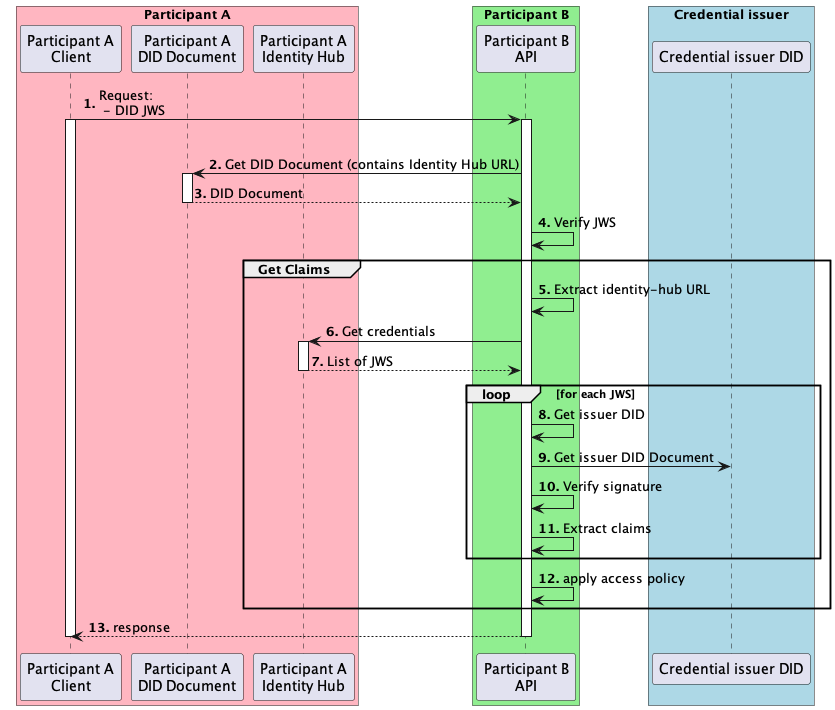

# Identity Hub - Get claims

This document explains how we will get the claims of a participant, in order to apply access policies.

## Context

When an EDC participant receives an IDS request, it must verify the caller's identity and apply access policies for the caller.
To apply policies, it needs to get the claims of the participant.
This document explains the mechanism to get the claims from IdentityHub.

## What is a claim

A claim is a statement about a subject. For example, a claim could be `ParticipantA` is in `region` `eu`. 
See [this documentation](https://www.w3.org/TR/vc-data-model/#claims) for more details.

## Get claims

This document focuses on getting the claims of a Participant, assuming the participant's identity is already verified.
The participant will use the claims to apply the access policy.

Let's focus on the `Get claims` box.
`Participant B` wants to get the claims of `Participant A`, to apply access policy.
For example, Participant A could have the policy that Participant B should be claimed as a `participantOf`
`dataspaceA` by the issuer "gaia-x.com".

5. Participant B extracts the identity-hub URL of participant A from a JWS obtained in previous steps.
6. Participant B gets VerifiableCredentials from IdentityHub A
7. Participant B gets a list of JWS
For each JWS:
   8. Participant B parses the JWS, extracts the DID URL of the issuer from the JWS payload.
   9. Participant B Gets the issuer DID.
   10. From the issuer DID, participant B get the public key of the issuer and uses it to verify the JWS signature
   11. If the signature is successfully verified, it extracts the claims of the participant, each claims needs to be associated with its issuer
8. The list of the claims will be used as input to apply the access policies
