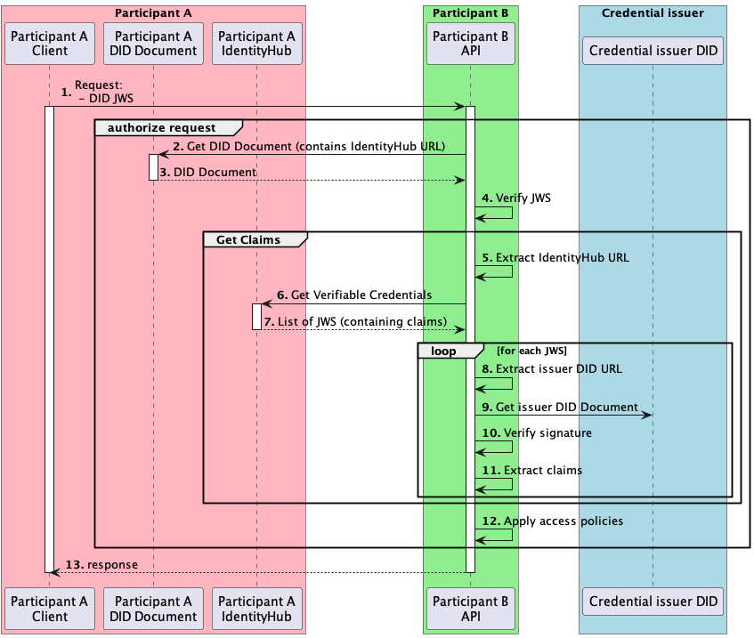

# Identity Hub - Get claims

This document explains how we will get the claims of a participant, in order to apply access policies.

## Context 
When an EDC participant receives an IDS request, it needs to verify the caller identity, and apply access policies for the caller.
To be able to apply policies, it needs to get the claims of a participant (for example, the claim that is participant is in region eu).
This document explains the mechanism to get the claims from IdentityHub.

## Get claims

This document focus getting the claims of a Participant, assuming the identity of the participant is already verified.
The participant will use the claims to apply access policy.

Let's focus on the `Get claims` box.
Participant B wants to get the claims of participant A, to apply access policy.
For example Participant A could have the policy that Participant B should have been claimed as a `participantOf` 
`dataspaceA`. The policy could require that the issuer of this claim should be "gaia-x.com".

5. Participant B extract the identity-hub URL of participant A from a JWS obtained in previous steps.
6. Participant B get VerifiableCredentials from IdentityHub A
7. Participant B gets a list of JWS
8. Participant B parses the JWS, extract the DID URL of the issuer from the JWS payload.
9. Participant B Get the issuer DID.
10. From the issuer DID, participant B get the public key of the issuer and uses it to verify the JWS signature
11. If the signature is successfully verified, it extracts the claims of the participant, each claims needs to be associated with its issuer to apply the policies later
12. The list of the claims will be used as an input to apply the access policies